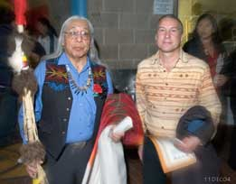

# Indigenous Law Institute

## "A Movement Toward Restoration and Healing"

### [**HELP SUPPORT OUR WORK!** Your generous donations to _Original Free Nations_ help make this work possible.](http://originalfreenations.com)

**BIRGIL KILLS STRAIGHT**
c/o Box 127
Kyle, South Dakota 57752

**[STEVEN T. NEWCOMB](mailto:stv4newcomb@yahoo.com)**
P.O. Box 188
Alpine, CA 91903 USA
619-618-9346

---

Monsignor Dr. Kuriakose Bharanikulangara (Vatican representative) and Steve Newcomb at the 9th Session of the U.N. Permanent Forum on Indigenous Issues, NYC (April 2010)

---

## Indigenous Law Institute Information

- [Introduction](ili_info.md#introduction)
- [Mission Statement](ili_info.md#mission-statement)
- [Foundational Summary](ili_info.md#foundational-summary)
- [Traditional Native Law](ili_info.md#traditional-native-law)
- [The Empire-Domination Model](ili_info.md#the-empire-domination-model)
- [Historical Unresolved Grief Seminars](ili_info.md#historical-unresolved-grief-seminars)

---

## Related Information and Essays

- [Synopsis of Steve Newcomb's columns at _Indian Country Today_, March 2002 - August 2007](http://www.indiancountry.com/author.cfm?id=226)
- [Toward an Oglala Lakota Constitution: Statement of Basic Principles](constitution.md)
- [Failure of the United States Indian Claims Commission to File a Report with Congress in the Western Shoshone Case (Docket 326-K)](http://www.nativeweb.org/pages/legal/shoshone/ili-report.html)
- [A MAU A MAU: TO CONTINUE FOREVER](amau.md)
- [Comment: Pope Asks Forgiveness - Will The Vatican Repeal The Inter Cetera?](pope.md)
- [Comment: _Rice v. Cayetano_](rice.md)
- [Declaration of Vision: Toward The Next 500 Years](dovision.md)
- [Five Hundred Years of Injustice: The Legacy of Fifteenth Century Religious Practices](sdrm_art.md)
- [New Studies Document the Role of Christianity in Historic Oppression](newstudy.md)
- [Perspectives: Healing, Restoration, and Rematriation](perspect.md)
- [The Pu'uhonua Peace Pact](peacepact.md)
- [Revoke the Inter Cetera Bull](ricb.md)
- [Scholar Calls on Pope](ictarticl.md)
- [Toward the Global Liberation of All Nations and Peoples](global_liberation.md)

---

**EMAIL INDIGENOUS LAW INSTITUTE:** [Steve Newcomb](mailto:stv4newcomb@yahoo.com)

---

These pages are hosted on NativeWeb and maintained by [Peter d'Errico](http://www.umass.edu/legal/derrico/) for the Indigenous Law Institute.

